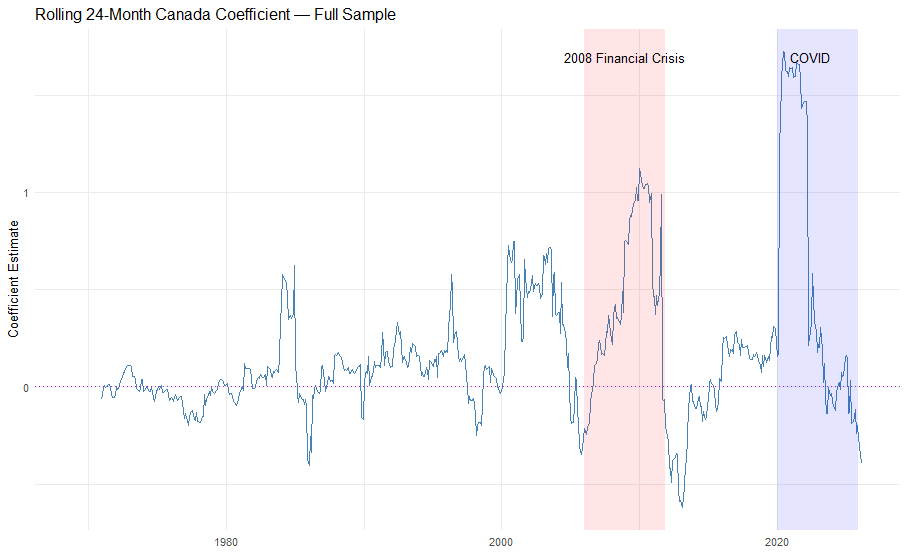
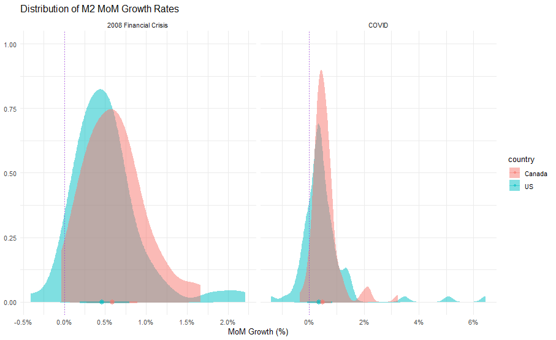
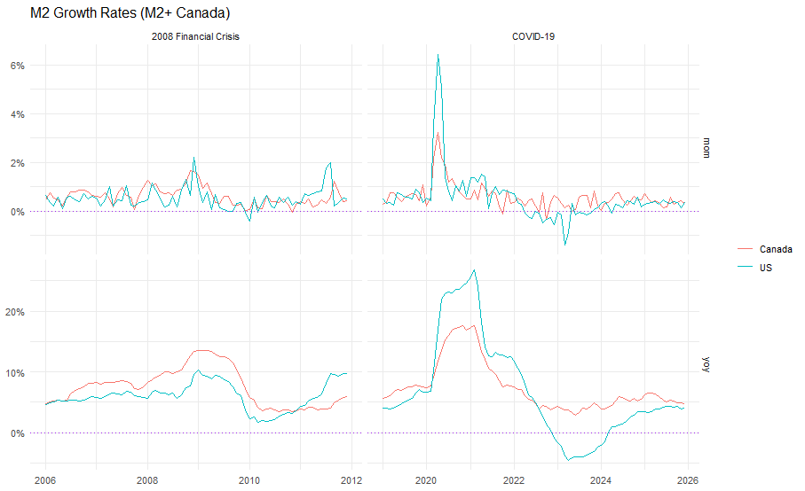

# m2-monetary-analysis
Independent reseach on US M2 and Canadian M2+ growth rates.

## Repository Structure

```
m2-monetary-analysis/
├── data/
│   ├── M2SL.csv
│   └── Canada_e1_monthly-sd-1946-01-01.csv
├── R/
│   └── analysis.R
├── output/
│   ├── findings_summary.txt
│   └── figures/
│       ├── ACFBoth.png
│       ├── ACFResid.png
│       ├── ARX1Can.png
│       ├── ARX1Full.png
│       ├── ARX1FullCan.png
│       ├── ARX1US.png
│       ├── CrisisGrowthDistributions.png
│       ├── CrisisGrowthRates.png
│       ├── CrisisRollingWindow.png
│       ├── ECDF.png
│       ├── FullGrowthDistributions.png
│       ├── QQ.png
│       ├── RollingWindowFull.png
│       ├── YoYARX1Can.png
│       ├── YoYARX1CanFull.png
│       ├── YoYARX1US.png
│       └── YoYARX1USFull.png
├── .gitignore
└── README.md
```

# US-Canada M2 Monetary Aggregate Analysis

## Key Findings
- The US Granger-causes Canada on a MoM basis over the full sample (p = 0.007) 
  but Canada does not Granger-cause the US (p = 0.143) — asymmetric relationship
- Canada-US monetary coupling is episodic and crisis-driven — the rolling 24-month 
  coefficient spikes to ~2.0 during COVID, the largest value in the 57-year sample
- Bootstrap Granger corrected a false positive GFC result (parametric p = 0.0497, 
  bootstrap p = 0.279) driven by non-normal VAR residuals
- YoY ARX(1) R-squared is mechanically inflated due to 11/12 overlap in the 
  rolling sum — MoM is the preferred specification

## Overview
Comparative analysis of US M2 and Canada M2+ monthly growth rates from 1970 to 2026, 
examining the dynamic relationship between the two countries' monetary aggregates 
across crisis periods including the 2008 Financial Crisis and COVID-19.

## Methods
- ARX(1) regression, both directions
- VAR with bootstrap Granger causality
- Rolling 24-month coefficient estimation
- Distributional analysis via halfeye and ECDF plots

## Key Visualizations

### Rolling 24-Month Canada Coefficient — Full Sample


### Distribution of M2 MoM Growth Rates by Crisis Period


### M2 Growth Rates — Crisis Windows


## Requirements
R 4.2.3+, packages: tidyverse, slider, ggdist, scales, broom, vars
